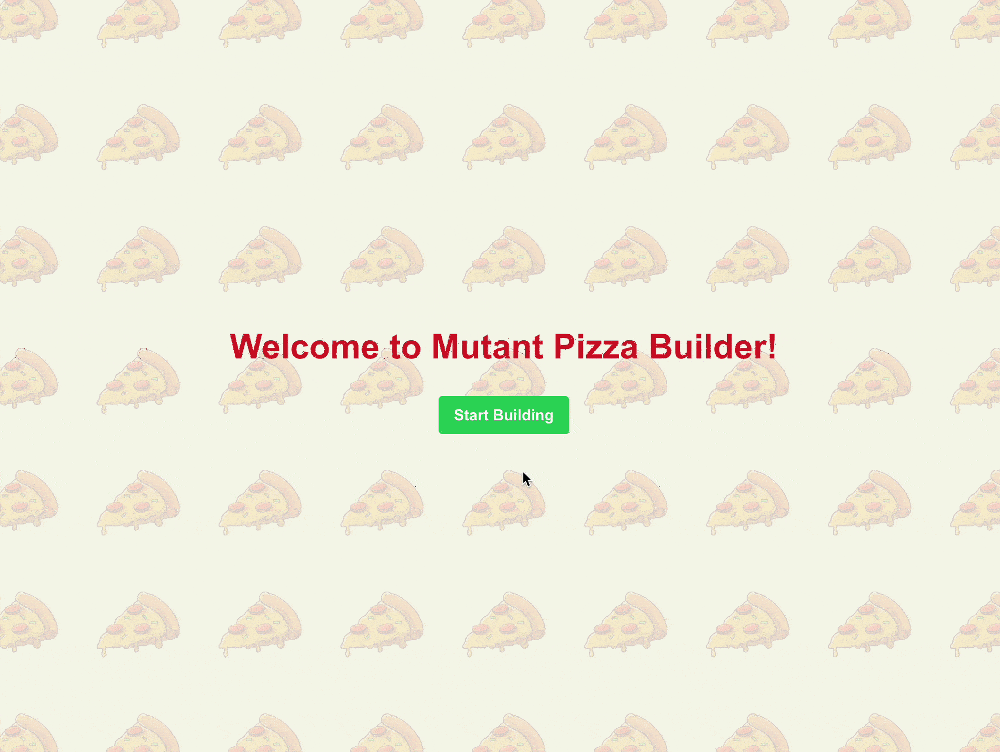

# 🍕 Mutant Pizza Builder

An interactive web app that combines pizza creation with mutation testing education. Build your perfect pizza while learning software testing concepts!

[](https://sonarcloud.io/summary/new_code?id=gertoska_mutant-pizza-builder)
[](https://dashboard.stryker-mutator.io/reports/github.com/gertoska/mutant-pizza-builder/main)



## ✨ Features

- 🛠️ **Interactive Pizza Builder**
  - Multiple crust options (thin, thick, stuffed)
  - Extensive topping selection
  - Real-time price calculation

- 📚 **Learn Mutation Testing**
  - Built-in examples of mutation testing concepts
  - Tutorials and explanations

- 💻 **Developer Experience**
  - 100% TypeScript code coverage
  - Comprehensive test suite
  - Modern tooling and best practices

## 🚀 Quick Start

```bash
# Clone the repository
git clone https://github.com/gertoska/mutant-pizza-builder.git

# Install dependencies
npm install

# Start development server
npm run dev
```

Visit `http://localhost:3000` to start building your pizza!

## 🧪 Testing

```bash
# Run unit tests
npm test

# Run tests with coverage
npm run test:coverage

# Run mutation tests
npm run test:mutation
```

## 🛠️ Tech Stack

- **Framework**: Next.js 15
- **Language**: TypeScript
- **Styling**: TailwindCSS
- **Testing**: Jest, React Testing Library, Stryker
- **Quality**: ESLint, Prettier

## 📖 Mutation Testing Guide

Mutation testing helps ensure your test suite's effectiveness by introducing small code changes ("mutants") and verifying if your tests catch them. Learn more:

- [Introduction to Mutation Testing](https://medium.com/@german.cano/mutation-testing-mejora-la-efectividad-de-tus-tests-7838088c45efd)
- [Example Mutations](docs/example-mutations.md)

## 🤝 Contributing

Contributions are welcome!

## 📜 License

This project is licensed under the MIT License - see the [LICENSE](LICENSE) file for details.

## 🙏 Acknowledgments

- Pizza vector images by [Vecteezy](https://www.vecteezy.com)
- Inspired by Josh Goldberg's work on mutation testing and the [RoboCafe example](https://github.com/JoshuaKGoldberg/robocafe-example)
- Built with ❤️ by [gertoska](https://github.com/gertoska)
